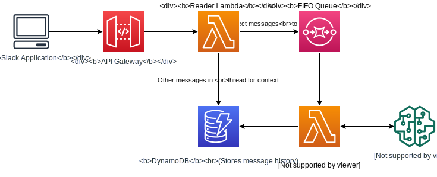

# langchain-aws-template
This package contains code templates to deploy langchain based services to AWS. The templates contain both the infrastructure (CDK code) and the application code to run these services. At present, the following templates are included.
1. **[Lambda Service](./service)**: An API Gateway + Lambda based REST service, that can connect to any front end application to create a chat like request-reply application. There is a demo web app included to interact with the deployed service.

1. **[Slack Bot](./slack_bot)**: An API Gateway + Lambda based REST service, that can process slack messages by calling an LLM chain and send reply to the slack channel where the bot is installed.  

## Prerequisites
- nodejs 18+
- Python 3.9+
- aws-cdk toolkit (`npm install -g aws-cdk`)
- AWS account configured with credentials (https://docs.aws.amazon.com/cdk/v2/guide/getting_started.html#getting_started_prerequisites)
- openai api key saved in Secrets Manager in your AWS Account
    - Expected secret name is `api-keys`
    - openai key is expected to be stored with `openai-api-key` key

